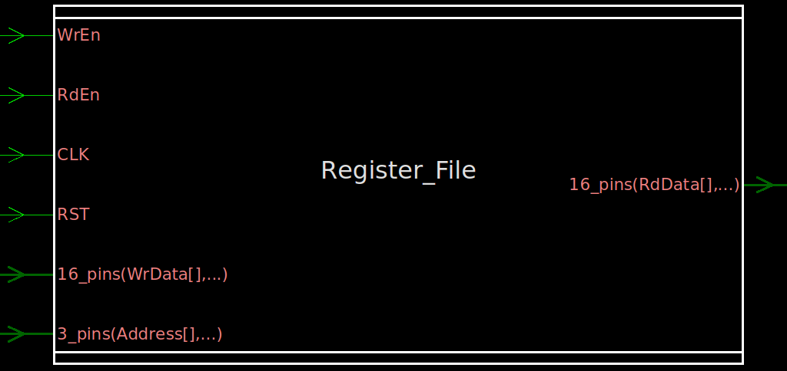
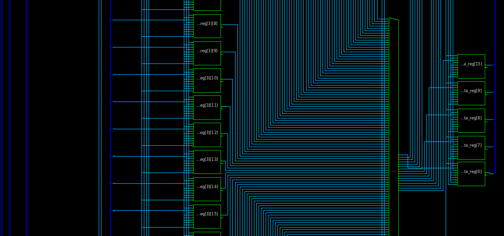
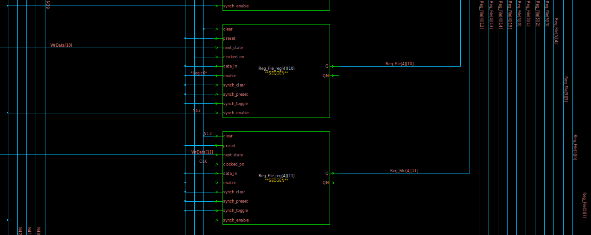
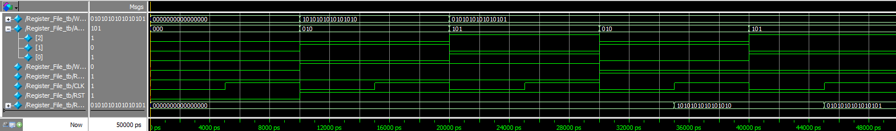

# Register File (Verilog)

An 8-entry, 16-bit-wide register file with a single shared read/write data port, synchronous write, registered (one-cycle-latency) read, and an active-low asynchronous reset.

<p align="center">
  
</p>

## Port List

| Signal    | Direction | Width  | Description                                      |
|-----------|-----------|--------|---------------------------------------------------|
| `WrData`  | Input     | [15:0] | Data to write into the selected register          |
| `Address` | Input     | [2:0]  | Selects one of 8 registers (`Reg_File[0..7]`)      |
| `WrEn`    | Input     | 1      | Write enable — higher priority than `RdEn`         |
| `RdEn`    | Input     | 1      | Read enable                                        |
| `CLK`     | Input     | 1      | Clock (rising-edge triggered)                      |
| `RST`     | Input     | 1      | Asynchronous reset, **active low**                 |
| `RdData`  | Output    | [15:0] | Registered read data output                        |

## Design Behavior

The register file holds 8 registers, each 16 bits wide (`Reg_File[7:0]`).

- **Reset**: while `RST` is low, all 8 registers and `RdData` are asynchronously cleared to `0`.
- **Write**: on the rising edge of `CLK`, if `WrEn` is high, `WrData` is written into `Reg_File[Address]`.
- **Read**: on the rising edge of `CLK`, if `WrEn` is low and `RdEn` is high, `Reg_File[Address]` is registered onto `RdData` — so read data appears **one clock cycle after** `RdEn`/`Address` are set, not combinationally.
- **Priority**: `WrEn` takes priority over `RdEn` — a simultaneous write and read request results in a write only, and `RdData` holds its previous value that cycle.
- If neither `WrEn` nor `RdEn` is asserted, both the registers and `RdData` hold their current values.

## RTL Schematic

<p align="center">
  
</p>
<p align="center">
  
</p>

## Testbench

`Register_File_tb.v` drives a free-running clock (10 ns period) and exercises four scenarios:

| Scenario | Action                                    | Expected Result                     |
|----------|--------------------------------------------|---------------------------------------|
| 1        | Write `16'hAAAA` to `Address = 2`           | `Reg_File[2] = AAAA`                  |
| 2        | Write `16'h5555` to `Address = 5`           | `Reg_File[5] = 5555`                  |
| 3        | Read from `Address = 2`                     | `RdData = AAAA` (registered next cycle) |
| 4        | Read from `Address = 5`                     | `RdData = 5555` (registered next cycle) |

An asynchronous reset is applied at the start of simulation to clear the register file before the first write.

### Waveform

<p align="center">
  
</p>

## Running the Simulation (ModelSim / QuestaSim)

```tcl
cd RTL
vlib work
vlog Register_File.v Register_File_tb.v
vsim -gui work.Register_File_tb
do wave.do
run -all
```

`wave.do` preloads the waveform view with `WrData`, `Address`, `WrEn`, `RdEn`, `CLK`, `RST`, and `RdData`.

## Linting

The design was checked with **Synopsys SpyGlass** (`Lint/Lint.prj`, `rtl_handoff` methodology). The `moresimple` report came back clean — only informational design-read messages, no lint violations.

## Synthesis Cell Report

`RTL/Cells_Report.txt` lists the mapped cell inventory: 8 registers × 16 bits (`Reg_File_reg[0..7][0..15]`) plus a 16-bit registered read output (`RdData_reg[0..15]`) and the address-decode/mux logic feeding it — **176 cells** total.

## Repository Structure

```
.
├── RTL/
│   ├── Register_File.v      # RTL design
│   ├── Register_File_tb.v   # Testbench
│   ├── wave.do               # ModelSim/QuestaSim waveform config
│   └── Cells_Report.txt      # Synthesis cell inventory report
├── Lint/
│   ├── Lint.prj              # SpyGlass lint project file
│   ├── moresimple.rpt        # SpyGlass lint report
│   └── ss                    # SpyGlass run artifacts
├── images/
│   ├── Register_File.png     # Block symbol
│   ├── Register_File_RTL.png # RTL schematic (top level)
│   ├── Register_File_RTL2.png# RTL schematic (register array detail)
│   └── WaveForm.png            # Simulation waveform
├── LICENSE
└── README.md
```

## License

See [LICENSE](LICENSE) for details.
